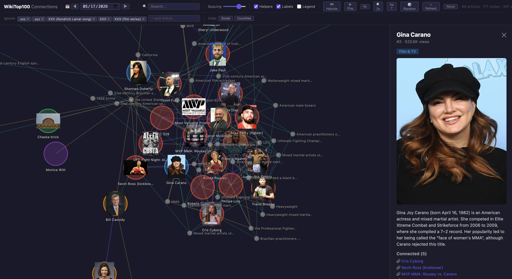

# WikiTop100 Connections

An interactive visualization of the top 100 most popular English Wikipedia articles for a given day, showing how they connect through wikilinks, shared categories, and named entities.

The app has two modes:

- **Explore** — the full interactive force-directed graph. Search, filter, drag nodes, hover for connections, click for details. A "lean forward" experience for analysis and discovery.
- **Play** — auto-advances through every article one by one, smoothly centering and highlighting each node and its connections. Adjustable speed (2s–8s per article), zoom level, and random-walk order. A "lean back" experience ideal for big screens, event displays, or screensaver-style viewing.

**Live at [wikiptop100.toolforge.org](https://wikitop100.toolforge.org)** — May 17, 2026: 100 articles, 72 helper nodes, 396 connections.



## How It Works

```
top.hatnote.com API  ──►  build_graph.py  ──►  NDJSON stream  ──►  index.html
  (top 100 list)           (Python pipeline)      (progress + data)     (D3.js viz)
```

1. **Fetch** the top 100 from `https://top.hatnote.com/en/wikipedia/{year}/{month}/{day}.json`
2. **Enrich** each article by fetching its categories, internal links, and intro text from the MediaWiki API (async, 3 concurrent calls, with exponential backoff on retry)
3. **Analyze** with spaCy NER to extract people, organizations, places, and events from summaries
4. **Build** a graph with three connection types:
   - **Wikilinks** (purple) — direct `[[links]]` between top 100 articles
   - **Categories** (green) — shared meaningful Wikipedia categories
   - **Entities** (orange) — shared named entities (companies, people, places)
5. **Visualize** with a D3.js force-directed graph; pipeline progress streamed to the UI via NDJSON

## Usage

```bash
# Setup
python3 -m venv .venv
source .venv/bin/activate
pip install -r requirements.txt
python3 -m spacy download en_core_web_sm

# Run tests
python3 -m pytest tests/

# Copy and customize config (optional)
cp .env.example .env
# Edit .env to set your contact email, API endpoints, etc.

# Build graph for today (CLI)
python3 build_graph.py

# Specify a date (year month day)
python3 build_graph.py 2026 5 17

# Custom output path and entity threshold
python3 build_graph.py 2026 5 17 graph_data.json 3

# Serve the visualization (with date picker, live API)
python3 server.py
# Open http://localhost:8080

# Or serve static files only (no date picker)
python3 -m http.server 8080
# Open http://localhost:8080
```

## Configuration

All settings are optional. Set them via environment variables, a `.env` file (see `.env.example`), or directly in the UI.

| Variable | Default | Description |
|----------|---------|-------------|
| `WIKI_USER_AGENT` | `WikiTop100Viz/1.0 (contact: ...)` | User-Agent for MW API (must include email/URL, or you'll be rate-limited) |
| `WIKI_HATNOTE_URL` | `https://top.hatnote.com/...` | Hatnote API endpoint template |
| `WIKI_MW_API` | `https://en.wikipedia.org/w/api.php` | MediaWiki API endpoint |
| `WIKI_MAX_CONCURRENT` | `3` | Concurrent async HTTP requests |
| `WIKI_CACHE_DIR` | `.cache` | Directory for cached API responses |
| `WIKI_HATNOTE_CACHE_TTL` | `86400` | Hatnote cache TTL in seconds (24h) |
| `WIKI_MW_CACHE_TTL` | `604800` | MediaWiki cache TTL in seconds (7d) |

Example:
```bash
WIKI_USER_AGENT="MyViz/1.0 (me@example.com)" WIKI_MAX_CONCURRENT=5 python3 server.py
```

## Visualization Controls

| Control | Action |
|---------|--------|
| Search | Filter articles by name in real-time |
| Helpers toggle | Show/hide category and entity helper nodes |
| Labels toggle | Show/hide all node labels (on by default) |
| Legend toggle | Show/hide the color legend |
| Spacing slider | Adjust force simulation repulsion |
| Date picker + ◀ ▶ | Navigate between days (triggers live rebuild) |
| ▶ Play / ⏹ Stop | Auto-advance through articles #1–#100; click to cycle speed (2s/3s/5s/8s) |
| Ignore list | Add articles to exclude; persisted in URL (`?ignore=`) |
| Hide buttons | One-click filters (Social media apps, Geography cluster) |
| 📷 Image source | Toggle between Hatnote and Wikipedia article thumbnails |
| ⚙ UA settings | View/change User-Agent; non-compliant agents trigger a warning |
| ⟳ Refresh | Clear cache and rebuild the current date |
| ⚠ Failed articles | Warning indicator with list of rate-limited articles |
| About | Project overview, controls reference, and credits |
| Hover | Highlight connected subgraph + tooltip |
| Click (article) | Open side panel with summary and connections |
| Click (helper) | Open side panel with connected article list |
| Drag | Reposition nodes |
| Scroll | Zoom in/out |
| Pan | Click and drag background |

During pipeline execution, a progress overlay shows each step: fetching top 100, per-article metadata (e.g., "45/100"), NER, and graph assembly.

## URL Parameters

All UI state can be set via URL query parameters for bookmarking and sharing:

| Parameter | Values | Default | Description |
|-----------|--------|---------|-------------|
| `date` | `YYYY-MM-DD` | today | Load a specific date |
| `ignore` | comma-separated article titles | `.xxx`,`.xyz`,XXX articles | Articles to exclude |
| `spacing` | `0`–`100` | `27` | Force simulation repulsion |
| `helpers` | `0` or `1` | `1` | Show helper nodes |
| `labels` | `0` or `1` | `1` | Show node labels |
| `legend` | `0` or `1` | `0` | Show color legend |
| `image` | `hatnote` or `page` | `hatnote` | Image source for thumbnails |
| `speed` | `2`, `3`, `5`, or `8` | `3` | Seconds per node in playback |
| `zoom` | `0.5`, `1`, `1.5`, `2`, or `3` | `1` | Playback zoom level |
| `fontsize` | `7`–`14` | `10` | Label font size in pixels |
| `order` | `rank` or `random` | `rank` | Playback order |
| `play` | `1` | — | Auto-start playback on load |

Example:
```
http://localhost:8080/?play=1&date=2026-05-17&speed=5&zoom=2&fontsize=7&order=random
```

## Dependencies

- Python 3.12+
- `httpx`, `networkx`, `spacy` (+ `en_core_web_sm`)
- D3.js v7 (loaded from CDN in `index.html`)
- `pytest` (for running tests)

## Deployment

See [DEPLOY_TOOLFORGE.md](DEPLOY_TOOLFORGE.md) for deploying to Wikimedia Toolforge as a build service container. The project uses Cloud Native Buildpacks (via `Procfile`) and supports the `$PORT` environment variable convention. A `Dockerfile` is also included for alternative container builds.

## Project Structure

```
.
├── .env.example         # Environment variable reference (copy to .env)
├── .dockerignore        # Files excluded from Docker build context
├── build_graph.py       # Python pipeline: fetch → parse → analyze → export
├── server.py            # HTTP server with /api/graph endpoint (streaming NDJSON)
├── index.html           # D3.js force-directed graph visualization
├── Procfile             # Build service process definition (web)
├── bin/post_compile     # Build hook: downloads spaCy model during image build
├── Dockerfile           # Alternative container build (manual Docker use)
├── graph_data.json      # Pre-built graph data (gitignored, run build_graph.py to generate)
├── requirements.txt     # Python dependencies
├── tests/               # pytest test suite (36 tests)
├── .venv/               # Python virtual environment
├── .cache/              # Cached API responses (gitignored, auto-created)
├── README.md            # This file
├── ROADMAP.md           # Future plans and architecture decisions
├── DEPLOY_TOOLFORGE.md  # Toolforge deployment guide
└── AGENTS.md            # Development log, decisions, and conventions
```
